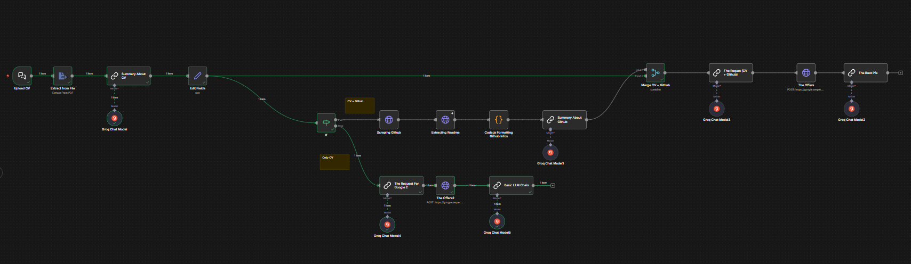

# 🕵️‍♂️ AI PFE Hunter Agent (Tunisia Edition)


> **Un système d'orchestration multi-agents autonome qui trouve le stage PFE parfait en croisant votre CV avec la réalité technique de votre code GitHub.**

<br>
<p align="center">
  
</p>
<br>

## 📺 Démo du Projet

Voir l'agent en action (Vidéo de démonstration) :
[]()

---

## 💡 Le Problème

Les étudiants ingénieurs peinent souvent à trouver des stages PFE (Projet de Fin d'Études) pertinents. Les recherches classiques par mots-clés sont limitées : elles ne comprennent ni le **niveau réel** du candidat, ni ses **compétences prouvées**.

## 🤖 La Solution : Un Pipeline d'Orchestration IA

Ce projet n'est pas un simple scraper. C'est un **pipeline d'orchestration LLM** sophistiqué qui intègre des données externes pour agir comme un Chasseur de Têtes Technique Senior.

Contrairement à un système RAG passif, cet agent effectue une **investigation active en temps réel** :
1.  **Ingestion :** Il lit et comprend sémantiquement votre CV (PDF).
2.  **Audit Technique :** Il scanne votre GitHub via API pour vérifier vos compétences réelles (Preuve par le code).
3.  **Stratégie de Recherche :** Il construit des requêtes complexes (Google Dorking) basées sur vos compétences validées.
4.  **Filtrage & Matching :** Il élimine le bruit pour ne garder que les opportunités de haute qualité (PFE Books officiels, Software Houses).

---

## 🏗️ Architecture Technique

Le système repose sur une architecture événementielle pilotée par **n8n** (auto-hébergé via Docker).

### Vue d'ensemble du Pipeline de Données :
`Ingestion PDF` -> `Profilage Sémantique` -> `Parsing JSON` -> `Routage Intelligent (If/Else)`

#### 🟢 Branche A : L'Audit Technique Approfondi (Si GitHub détecté)
* **Scraping API GitHub (REST) :** Récupération des métadonnées des 5 derniers projets.
* **Deep Fetching Pattern :** Itération pour récupérer le contenu brut des fichiers `README.md` (Pattern List-to-Detail).
* **Tech Lead Agent (LLM) :** Analyse de la documentation pour évaluer la qualité du code (Architecture, Docker, Tests). Détermine la séniorité réelle (Junior vs Confirmé).
* **Fusion de Données :** Merge des données Déclaratives (CV) et Prouvées (GitHub).

#### 🔴 Branche B : La Stratégie Standard (Sans GitHub)
Cette branche s'active si aucun portfolio n'est trouvé.
* **Strategy Agent :** Déduit la meilleure stratégie de recherche uniquement sur la base du background académique et des compétences déclarées.

#### 🏁 Moteur de Recherche & Matching (Web Retrieval)
* **Strategy Generator Agent :** Crée dynamiquement une requête Google complexe (ex: `("PFE Book 2026") AND ("Spring Boot" OR "Angular") AND "Tunisie" -linkedin`).
* **Serper API :** Exécution de la recherche sur le web tunisien (Contexte local).
* **Final Judge Agent :** Agit comme un mentor carrière. Il croise les offres trouvées avec le profil du candidat pour générer une recommandation justifiée.
    * *Exemple de sortie :* "Je recommande cette offre Microservices chez Vermeg car tu as déjà implémenté une architecture similaire dans ton projet 'Medical-Office'."

---

## 🛠️ Stack Technologique

* **Orchestration :** n8n (Workflow Automation).
* **LLM (Cerveau) :** Groq (Llama-3.3-70b-versatile) pour une inférence ultra-rapide.
* **Recherche Web :** Serper.dev (Google Search API).
* **Déploiement :** Docker & Docker Compose.

---

## 🚀 Installation & Utilisation

### Prérequis
* Docker & Docker Compose installés.
* Clés API pour : **Groq** et **Serper.dev**.

### Comment lancer l'agent ?
1.  Cloner ce dépôt :
    ```bash
    git clone [https://github.com/MahdiBoughariou/ai-pfe-hunter.git](https://github.com/MahdiBoughariou/ai-pfe-hunter.git)
    cd ai-pfe-hunter
    ```
2.  Importer le workflow :
    * Ouvrez votre instance n8n.
    * Importez le fichier `workflow.json` inclus dans ce dépôt.
3.  Configurer les Credentials dans n8n :
    * `Groq API`
    * `Header Auth` (pour Serper) : Utilisez le header `X-API-KEY`.
4.  **Lancer :** Ouvrez l'interface de Chat n8n, uploadez votre CV et laissez la magie opérer !

---

## 👤 Auteur

**Mahdi Boughariou**
* Étudiant en Génie Logiciel
* [Mon GitHub](https://github.com/MahdiBoughariou)
